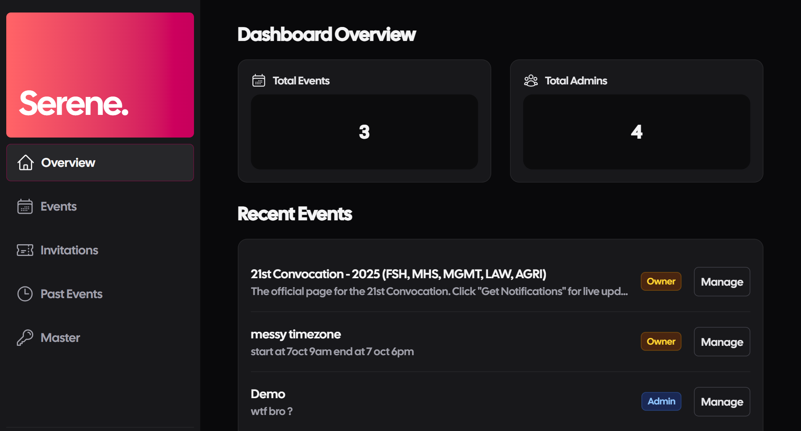
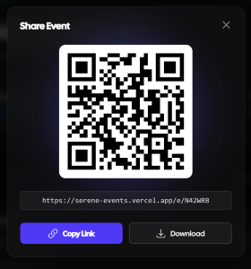
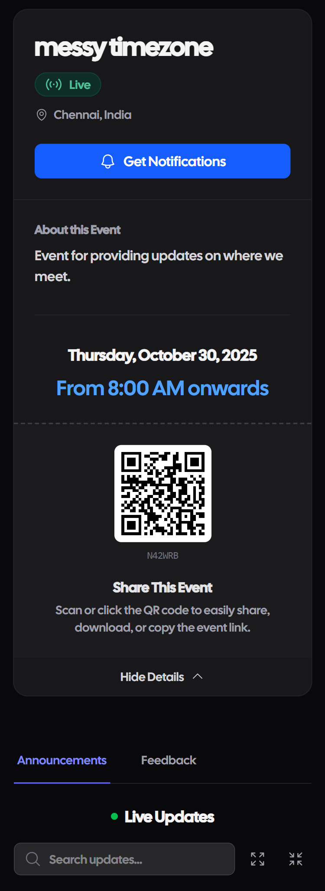
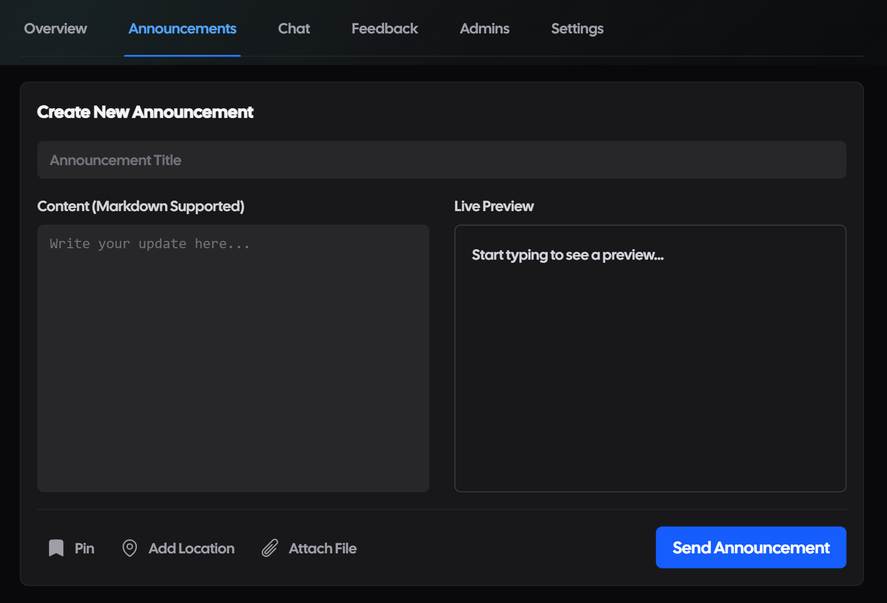

# Serene Events 🎫



<div align="center">


**The Operating System for Campus Events.**
*Scalable event orchestration, real-time analytics, and seamless attendee engagement.*

[View Demo](https://serene-events.vercel.app) · [Report Bug](https://github.com/rajavenkatesh04/serene-events/issues)

</div>

---

### 🚀 The Problem
Managing university events is fragmented. Organizers juggle Google Forms for registration, WhatsApp for announcements, and spreadsheets for attendance. **Serene Events** unifies this lifecycle into a single, real-time platform handling everything from ticket generation to post-event analytics.

### ⚡ Key Capabilities

#### 1. Real-Time Command Center
The "Master Dashboard" provides a bird's-eye view of all operations.
* **Live Metrics:** Visualized registration trends and feedback scores using `Recharts`.
* **Role-Based Access Control (RBAC):** Granular permissions for "Masters", "Admins", and "Volunteers" secured via custom Middleware.
* **God Mode:** Advanced administrative actions for system-wide oversight (`lib/actions/godModeActions.ts`).

#### 2. Frictionless Entry System
* **Dynamic QR Codes:** Auto-generated, unique entry passes for every attendee.
* **Rapid Check-in:** Scannable interface for volunteers to verify tickets in <2 seconds.
* **Offline Resilience:** `NetworkStatusIndicator` ensures UX stability during connectivity drops.

#### 3. Attendee Engagement Layer
* **Live Announcements:** Push notifications and pinned updates keep attendees informed instantly.
* **Interactive Maps:** Integrated Google Maps for precise venue navigation and multi-location events.
* **Social Feed:** Real-time chat and media sharing functionality powered by Firestore listeners.

---

### 📸 Product Tour

| **Admin Dashboard** | **QR Generation** |
|:---:|:---:|
|  |  |
| *Real-time analytics & controls* | *Instant ticket generation* |

| **Attendee View** | **Live Updates** |
|:---:|:---:|
|  |  |
| *Clean, mobile-first interface* | *Instant communication channel* |

---

### 🛠️ Technical Architecture

Built with a focus on **Performance** and **Type Safety**.

**Frontend Engineering:**
* **Next.js 14 App Router:** Leveraged Server Components (RSC) to minimize client-side JavaScript bundle size by ~30%.
* **Optimistic UI:** implemented `useOptimistic` patterns in chat and social actions for zero-latency user feedback.
* **Skeleton Loading:** Custom `skeletons.tsx` for layout shift prevention (CLS) during data fetching.

**Backend & Infrastructure:**
* **Server Actions:** Direct database mutations from frontend code, ensuring end-to-end type safety without manual API routes.
* **Firebase Firestore:** NoSQL data modeling optimized for high-read/low-write ratios common in event feeds.
* **Edge Middleware:** Route protection and authentication checks running on Vercel's Edge Network.

**Code Quality:**
* **TypeScript:** Strict type checking across the entire codebase.
* **Modular Design:** UI components separated into atomic units (`ui/dashboard`, `ui/themes`) for reusability.

---

### 💻 Getting Started

**Prerequisites:** Node.js 18+

1.  **Clone the repository**
    ```bash
    git clone [https://github.com/rajavenkatesh04/serene-events.git](https://github.com/rajavenkatesh04/serene-events.git)
    cd serene-events
    ```

2.  **Install dependencies**
    ```bash
    npm install
    ```

3.  **Configure Environment**
    Create a `.env.local` file in the root directory:
    ```env
    NEXT_PUBLIC_FIREBASE_API_KEY=your_key
    NEXT_PUBLIC_FIREBASE_AUTH_DOMAIN=your_domain
    NEXT_PUBLIC_FIREBASE_PROJECT_ID=your_id
    # ... add other firebase config
    ```

4.  **Run Development Server**
    ```bash
    npm run dev
    ```

---

### 🤝 Contributing

We welcome contributions! Please see `CONTRIBUTING.md` for details on how to submit a pull request.

**Core Maintainer:** [Raja Venkatesh](https://github.com/rajavenkatesh04)
